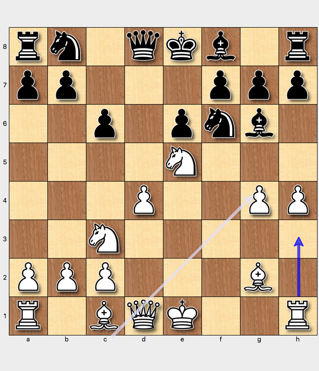
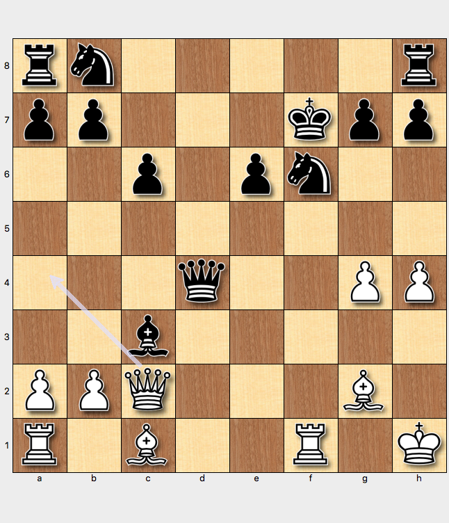

# Only you can know if the Leisebein variation is for you

In this chapter we write about an opening system to avoid asshats.

## The Feel of the BDG

Always attacking

For example in one of the more common and strong variations by Black. Bf5 in the Gunderam looks like this.

We want to attack that light squared bishop and open lines against the king using the pawn storm and alo b7 - now undefended.

The best way is the direct way.

1. d4 d5 2. e4 dxe4 3. Nc3 Nf6 4. f3 exf3 5. Nxf3 Bf5 6. Ne5 e6 7. g4 Bg6 8. Bg2
c6 9. h4!

Developing with h4! as always.

Now if Black responds aggressively here is a great new novelty.  As usual we prefer forced attacking lines.

e.g.

1. d4 d5 2. e4 dxe4 3. Nc3 Nf6 4. f3 exf3 5. Nxf3 Bf5 6. Ne5 e6 7. g4 Bg6 8. Bg2
c6 9. h4 Bb4 10. O-O Bxc2 11. Nxf7 Kxf7 12. Qxc2 Qxd4+ { - }  13. Kh1 Bxc3 14.

---

And now Bf4!! { Rune Novelty!  Database wanted Rf4}

---

"Rf4 is boring and equal"  
But Bf4 is unexpected and produces threats Black doesn't have time to coordinate.
* g5 with discovered check 
* Rd1 with tempo and control of the file and 7th rank